# 🎙️ 树莓派5 中文 TTS 语音合成系统

> Raspberry Pi 5 + PaddleSpeech FastSpeech2 + HiFiGAN · 离线 · 中文女声 · 接近真人

[](https://www.raspberrypi.com/products/raspberry-pi-5/)
[](https://www.arm.com/architecture/cpu/a-profile)
[](https://www.python.org/)
[](LICENSE)

---

## 📖 目录

- [项目简介](#项目简介)
- [快速开始](#快速开始)
- [项目文件结构](#项目文件结构)
- [量化优化成果](#量化优化成果)
- [原理详解](#原理详解)
- [Web 界面](#web-界面)
- [性能数据](#性能数据)
- [踩坑记录](#踩坑记录)
- [参考资料](#参考资料)

---

## 项目简介

在树莓派 5 上部署百度的 [PaddleSpeech](https://github.com/PaddlePaddle/PaddleSpeech) 神经网络中文 TTS，实现离线、低延迟、接近真人的中文语音合成。搭配 USB 喇叭自动播放，提供 Web 前端方便测试和集成。

### 技术栈

| 层级 | 技术 | 说明 |
|------|------|------|
| 声学模型 | FastSpeech2 (CSMSC baker) | 文本 → 梅尔频谱 |
| 声码器 | HiFiGAN V1 | 梅尔频谱 → 音频波形 |
| 文本前端 | BERT + G2PW + jieba | 多音字消歧、分词、音素转换 |
| 推理框架 | PaddlePaddle 3.2.2 + ONNX Runtime | CPU 推理 |
| Web 后端 | FastAPI + Uvicorn | RESTful API |
| 硬件 | Raspberry Pi 5, 8GB RAM | ARM Cortex-A76 |

---

## 快速开始

### 环境要求

- 树莓派 5 Model B (8GB RAM 推荐)
- Debian 13 / Ubuntu 24.04 (aarch64)
- Conda (Miniconda)
- USB 声卡 + 喇叭

### 安装

```bash
# 一键安装（约 30 分钟）
chmod +x install_paddlespeech.sh
./install_paddlespeech.sh
```

### 启动 Web 服务

```bash
conda activate paddlespeech

# 原版（稳定，首次启动 ~55s）
python tts_web.py                # http://树莓派IP:8765

# 量化优化版（推荐，首次启动 ~7s）
python tts_web_quantized.py      # http://树莓派IP:8766
```

### Python API 调用

```python
from paddlespeech.cli.tts import TTSExecutor

tts = TTSExecutor()
tts(text="你好，树莓派！", output="output.wav")
```

---

## 项目文件结构

```
~/tts/
├── tts_web.py                     # 原版 Web 服务 (端口 8765)
├── tts_web_quantized.py           # 🆕 量化优化版 Web 服务 (端口 8766)
├── install_paddlespeech.sh        # 一键安装脚本
├── test_paddlespeech_tts.py       # 命令行 TTS 测试
├── test_vosk.py                   # VOSK 语音识别测试
├── quantize_experiment.py         # 量化实验脚本
│
├── quantized_models/              # 🆕 量化产物（需本地生成）
│   ├── fastspeech2_full.pdparams  # FastSpeech2 纯权重 (142MB)
│   ├── hifigan_full.pdparams      # HiFiGAN 纯权重 (50MB)
│   ├── normalizer_params.pkl      # 归一化参数 (mu/sigma)
│   └── g2pW_int8.onnx            # G2P INT8 量化模型 (152MB)
│
├── PaddleSpeech-develop/          # PaddleSpeech 源码
├── models/                        # VOSK ASR 模型
│
├── 系统文档.md                     # 树莓派系统级文档
├── 交接文档-AI协作记录.md          # 技术交接文档（含踩坑全记录）
├── paddlespeech配置文档.md         # PaddleSpeech 配置参考
├── CSDN博客-树莓派5部署PaddleSpeech中文TTS.md  # CSDN 博客原文
└── README.md                      # 本文件
```

---

## 量化优化成果

| 指标 | 优化前 | 优化后 | 提升 |
|------|--------|--------|------|
| 模型加载时间 | 55s | 7s | **8×** |
| 模型总体积 | 2584MB | 744MB | **-71%** |
| 首句推理 (含加载) | 60s | 10s | **6×** |
| 单句推理 (12字) | 4.3s | 1.9s | **2.3×** |
| 内存占用 | 2.8GB | 1.5GB | **-46%** |
| 输出音频质量 | — | 差异 0.000000 | **一致** |

### 三级加速体系

| 层级 | 技术 | 加载加速 | 推理加速 |
|------|------|----------|----------|
| L1 权重瘦身 | state_dict 替代 .pdz | **8×** | 持平 |
| L2 G2P 量化 | ONNX INT8 动态量化 | 1× | 1.1× |
| L3 HiFiGAN ONNX | Paddle→ONNX FP32 导出 | 1× | **3×** |

> ARM64 版 ONNX Runtime 不支持 `ConvInteger` 算子，HiFiGAN INT8 量化暂不可用。

> 详细性能对比数据请见 [CSDN 博客第十四章](./CSDN博客-树莓派5部署PaddleSpeech中文TTS.md#十四运行效率对比总表)

---

## 原理详解

> 以下内容面向电气工程师和嵌入式开发者，尽量避免深度学习黑话，用电路/信号处理的类比来解释。

### 1. 语音合成流水线：三段式架构


这个三段式架构可以类比为一个信号处理链：

- **G2P（前端）** = 编码器：把自然语言编码成音素序列，类似把模拟信号采样量化
- **FastSpeech2（声学模型）** = 变换器：把离散的音素序列变换为连续的时频谱，类似 FFT 的逆过程
- **HiFiGAN（声码器）** = 解码器/功放：把频谱"放大"为可听的音频波形，类似 DAC + 功放

### 2. 梅尔频谱：为什么是 80×T 的矩阵？

人耳对频率的感知不是线性的。1000Hz 和 1100Hz 的差距听起来很大，但 10000Hz 和 10100Hz 几乎无法区分。

梅尔尺度（Mel Scale）模拟了这种非线性感知：

$$mel = 2595 \cdot \log_{10}(1 + \frac{f}{700})$$

FastSpeech2 把语音分解为 **80 个梅尔频带 × 时间帧** 的二维矩阵。每一列是该时刻的"瞬时频谱"，每一行是该频带的"音量包络"。

可以类比为：
- **示波器看时域** → 一维波形
- **频谱仪看频域** → 一维频谱（某一时刻）
- **语谱图看时频域** → 二维梅尔频谱（FastSpeech2 的输出）

### 3. 检查点 vs 纯权重：为什么 .pdz 又大又慢？

PaddlePaddle 的 `.pdz` 文件是**动态图训练检查点**（checkpoint），包含：

| 内容 | 占比 | 推理需要？ |
|------|------|-----------|
| 模型权重（weight） | ~20% | ✅ 必须 |
| Adam 优化器的 1 阶矩 m | ~30% | ❌ 训练才要 |
| Adam 优化器的 2 阶矩 v | ~30% | ❌ 训练才要 |
| 学习率调度器状态 | ~5% | ❌ 训练才要 |
| 训练轮数、batch 等元数据 | ~1% | ❌ 训练才要 |
| 序列化开销（pickle 格式） | ~14% | ❌ 纯浪费 |

> Adam 优化器为每个参数维护两个同形状的矩阵（m 和 v），这就是为什么检查点约是纯权重的 3-5 倍。

**类比**：检查点像一个包含所有草稿、批注、修改记录的 Word 文档，而 `state_dict` 只是最终干净的 PDF 输出。推理只需要 PDF。

### 4. Weight Normalization：一个参数变成三个的魔法

Weight Normalization 是一种神经网络参数化技巧，由 Tim Salimans 在 2016 年提出。它把一个权重向量 $\mathbf{w}$ 分解为方向 $\mathbf{v}$ 和大小 $g$：

$$\mathbf{w} = g \cdot \frac{\mathbf{v}}{\|\mathbf{v}\|_2}$$

**为什么这样做？** 在训练时，把方向和大小解耦可以让优化地形更平滑，加速收敛。类比电路中：
- $\mathbf{v}$ 是信号的方向（相位），决定"走哪条路"
- $g$ 是信号的增益（幅度），决定"走多快"
- $\|\mathbf{v}\|_2$ 是归一化因子，保证方向向量是单位长度

> **推理时的陷阱**：训练完成后，Weight Norm 的加速效果不再需要。如果不移除，模型在 `forward()` 时会实时计算 $\|\mathbf{v}\|_2$（每次推理都做额外的除法和开方），不仅浪费计算，在加载预训练权重时还会因为参数不一致导致输出错误。

这就是我们在量化优化中遇到的最大坑——详见下文「踩坑记录」第 4 节。

### 5. ONNX INT8 量化：精度换速度

神经网络默认使用 FP32（32 位浮点数）存储权重。INT8 量化就是把 32 位的浮点权重映射到 8 位整数：

$$w_{int8} = \text{round}\left(\frac{w_{fp32}}{scale}\right) + zero\_point$$

其中 $scale$ 和 $zero\_point$ 根据权重的分布自动计算。

**为什么能工作？** 训练好的神经网络权重往往集中在很小的数值范围内（比如 [-0.5, 0.5]），32 位的精度远超实际需要。压缩到 8 位后，精度损失通常 < 0.1%，但存储和计算都减少 4 倍。

**类比**：一个 24-bit/192kHz 的母带音频，转成 16-bit/44.1kHz 的 CD 音质，绝大多数人听不出区别。INT8 量化就是神经网络版的"有损压缩"。

**为什么用动态量化而不是静态量化？**
- **动态量化**：只量化权重，激活值在推理时动态计算范围。不需要校准数据集，实现简单。
- **静态量化**：同时量化权重和激活值。需要校准数据集来确定激活值的范围。精度更高但实现复杂。

对于 G2P 这种文本处理模型，动态量化足够，且一行代码即可完成。

### 6. 树莓派上的推理优化：CPU 专属策略

GPU 上做 INT8 推理收益巨大（Tensor Cores 原生支持），但树莓派只有 CPU。CPU 上的优化策略不同：

| 策略 | GPU 收益 | CPU 收益 | 采用 |
|------|----------|----------|------|
| INT8 量化 | ★★★★★ | ★★★★☆ | ✅ G2P 已做 |
| 算子融合 (Layer Fusion) | ★★★★☆ | ★★★☆☆ | ✅ ONNX Runtime 自动 |
| 内存布局优化 (NCHW→NHWC) | ★★★☆☆ | ★★★★☆ | ⚠️ 取决于框架 |
| 多线程并行 | ★★☆☆☆ | ★★★★★ | ✅ 2 线程最优 |
| 知识蒸馏 (小模型) | ★★★★☆ | ★★★★☆ | 待探索 |

树莓派 5 的 4 核 Cortex-A76 没有 SIMD 矩阵加速指令（如 x86 的 AVX-512 或 ARM 的 SVE），所以矩阵运算仍然是标量计算。主要的加速来自：
1. **减少数据搬运**（模型小了 71%，I/O 瓶颈缓解）
2. **减少内存占用**（省出的内存可做磁盘缓存）
3. **ONNX Runtime 的图优化**（常量折叠、死代码消除）

### 7. 实时性分析：从文本到声音的延迟分解

以一句 5 字中文（"你好树莓派"）为例，端到端延迟分解：

```mermaid
gantt
    title TTS 推理延迟分解 (优化版)
    dateFormat X
    axisFormat %s
    section 文本前端
    jieba 分词     :a1, 0, 300
    G2P 音素转换   :a2, 300, 800
    BERT 多音字    :a3, 800, 2000
    section 声学模型
    FastSpeech2    :b1, 2000, 4200
    section 声码器
    HiFiGAN        :c1, 4200, 7000
    section I/O
    写 WAV 文件    :d1, 7000, 7100
    aplay 播放     :d2, 7100, 7260
```



| 阶段 | 耗时 | 占比 | 可优化空间 |
|------|------|------|-----------|
| 文本前端 (jieba+G2P+BERT) | ~2.0s | 28% | BERT 可量化、可换轻量前端 |
| FastSpeech2 推理 | ~2.2s | 30% | 可尝试 INT8 量化 |
| HiFiGAN 推理 | ~2.3s | 32% | 可尝试 INT8 量化或多帧并行 |
| WAV 写入+播放 | ~0.7s | 10% | 已经很快 |

> 最理想的优化是使用 **流式推理**（streaming TTS），让 HiFiGAN 边生成边播放，用户感知延迟可降到 1 秒以内。PaddleSpeech 有 streaming TTS server 示例，但需要额外适配。

---

## Web 界面


- 输入中文文本，点击合成
- 自动通过 USB 喇叭播放
- 快捷短语按钮（问候、告警、温湿度等）
- 合成历史记录，可回放
- 响应式设计，手机可用

**访问地址**：
- 原版：`http://<树莓派IP>:8765`
- 优化版：`http://<树莓派IP>:8766`

---

## 性能数据

### 加载速度

```
原版:  ██████████████████████████████████████████████████████ 55s
优化:  ███████ 7s  (8x)
```

### 推理速度（模型预热后）

| 文本 | 长度 | 原版 | ONNX加速版 | 提升 |
|------|------|------|-----------|------|
| "你好" | 2 字 | 1.0s | 0.5s | 2.0× |
| "你好树莓派" | 5 字 | 2.1s | 1.0s | 2.1× |
| "前方发现障碍物请注意避让" | 12 字 | 4.3s | 1.9s | 2.3× |
| "温度三十七点五度湿度百分之六十" | 14 字 | 5.0s | 2.3s | 2.2× |

### 模型体积

```
原版:  ██████████████████████████████████████████████████████ 2584MB
优化:  ████████████ 744MB  (-71%)
```

### 内存占用

```
原版:  ████████████████████████████████████████ 2.8GB
优化:  ████████████████████ 1.5GB  (-46%)
```

### HiFiGAN ONNX 导出详情

| 项目 | 值 |
|------|-----|
| 导出方式 | `paddle.onnx.export` → opset 14 |
| ONNX 大小 | 52MB (FP32) |
| 算子折叠 | 1852 → 596 节点 (Polygraphy) |
| 精度验证 | Paddle vs ONNX 差异 = 0.000001 |
| INT8 量化 | ❌ ARM64 onnxruntime 不支持 ConvInteger |
| 加速效果 | 2.9-3.6× (vs PaddlePaddle) |

---

## 踩坑记录

以下是本项目开发过程中遇到的关键问题和解决方案：

| # | 问题 | 原因 | 解决 | 耗时 |
|---|------|------|------|------|
| 1 | `pip install paddlespeech` 导致树莓派死机 | 全量依赖一次性安装 OOM | `--no-deps` + 分步安装 | 2h |
| 2 | PyPI 无 aarch64 的 PaddlePaddle wheel | 百度未发布到 PyPI | 用百度 ARM 专用源 | 30min |
| 3 | 导入 TTSExecutor 触发全量模块加载 | Eager import 设计 | 改为懒加载（5个文件） | 3h |
| 4 | 量化版输出电流噪音（非人声） | HiFiGAN weight_norm 参数未正确恢复 | `remove_weight_norm` 必须先于 `set_state_dict` | 4h |
| 5 | paddlenlp 导入报错 | aistudio_sdk 不兼容 | try/except 修补 | 10min |
| 6 | aplay 报错 524 | 无默认音频设备 | 指定 USB 声卡 `plughw:2,0` | 10min |
| 7 | Python 3.13 不兼容 | PaddleSpeech 依赖 Python 3.10 | Conda 创建 3.10 环境 | 5min |

> 详细调试过程见 [交接文档-AI协作记录.md](./交接文档-AI协作记录.md) 第十章。

---

## 参考资料

- [PaddleSpeech GitHub](https://github.com/PaddlePaddle/PaddleSpeech) — 百度语音合成工具包
- [PaddlePaddle ARM 安装指南](https://www.paddlepaddle.org.cn/install/quick) — aarch64 专用源
- [HiFiGAN 论文](https://arxiv.org/abs/2010.05646) — 声码器原理
- [FastSpeech2 论文](https://arxiv.org/abs/2006.04558) — 声学模型原理
- [Weight Normalization 论文](https://arxiv.org/abs/1602.07868) — 权重归一化原理
- [ONNX Runtime 量化文档](https://onnxruntime.ai/docs/performance/quantization.html) — INT8 量化指南
- [树莓派 VOSK 语音识别](https://alphacephei.com/vosk/) — 离线 ASR 方案

---

## 许可证

MIT License

---

<p align="center">
  <b>Made with ❤️ on Raspberry Pi 5</b><br>
  <sub>2026.06 · 巡检TTS 项目组</sub>
</p>
